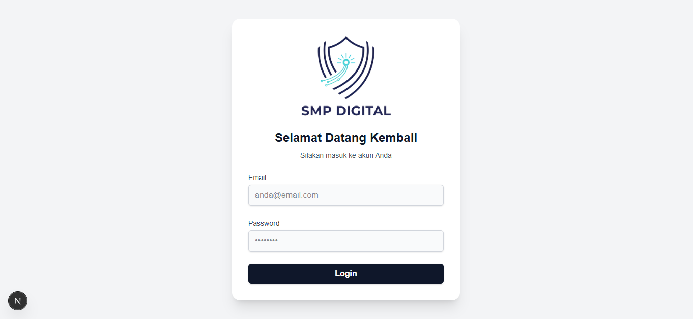
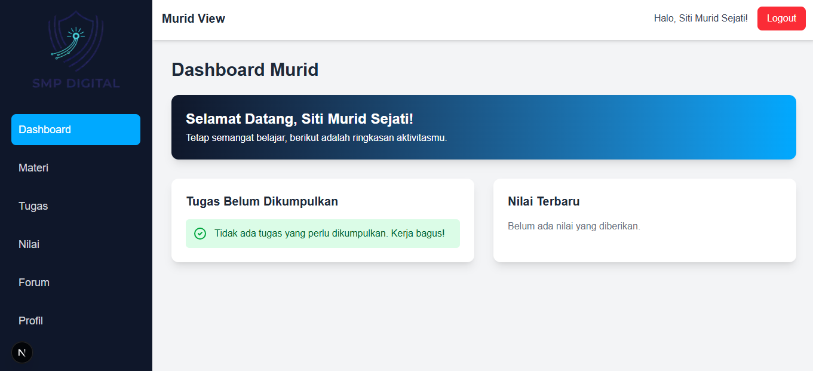
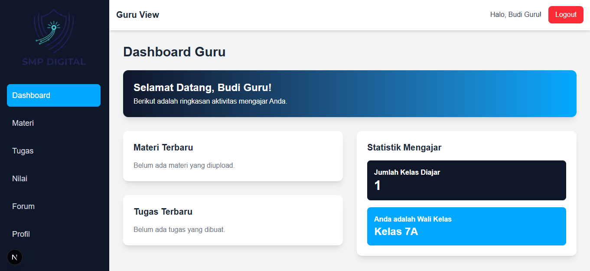

<p align="center">
  
</p>

<h1 align="center">LMS SMP Digital - Frontend</h1>
<p align="center">

</p>
Ini adalah antarmuka pengguna (frontend) untuk aplikasi **Learning Management System (LMS) SMP Digital**. Dibangun menggunakan **Next.js** dan ditata dengan **Tailwind CSS**, aplikasi ini menyediakan pengalaman pengguna yang modern, responsif, dan interaktif untuk semua fitur LMS.

Frontend ini sepenuhnya terpisah dari backend dan berkomunikasi melalui API RESTful yang disediakan oleh [**Backend Laravel**](https://github.com/fadillrr/lms-smp-backend).

---

## ✨ Fitur Utama

- **Antarmuka Responsif**: Desain yang beradaptasi dengan baik di perangkat desktop maupun mobile.
- **Dashboard Berbasis Peran**: Tampilan dashboard yang berbeda dan disesuaikan untuk **Guru** dan **Murid**.
- **Manajemen Konten Interaktif**: Modal dan form untuk mengupload materi, membuat tugas, memulai diskusi forum, dan memberi nilai.
- **Navigasi Client-Side**: Perpindahan antar halaman yang cepat tanpa perlu me-refresh halaman, berkat Next.js.
- **Manajemen Sesi**: Penyimpanan token autentikasi di sisi klien untuk menjaga sesi login pengguna.
- **Pembaruan Profil**: Halaman khusus bagi pengguna untuk memperbarui biodata, password, dan foto profil.

## 🖼️ Tampilan Aplikasi

Berikut adalah beberapa contoh tampilan dari aplikasi LMS SMP Digital.

| Halaman Login | Dashboard Murid | Halaman Profil |
| :---: | :---: | :---: |
|  |  |  |

*(**Catatan:** Anda perlu membuat folder `screenshots` di dalam folder `public` dan menyimpan screenshot aplikasi Anda di sana agar gambar-gambar di atas muncul).*

## 🛠️ Teknologi yang Digunakan

- **React.js**
- **Next.js** (Framework React)
- **Tailwind CSS** (untuk Styling)
- **Axios** (untuk HTTP Client)
- **ESLint** (untuk Linter)

---

## 🚀 Panduan Instalasi Lokal

Berikut adalah cara untuk menjalankan proyek ini di lingkungan development lokal Anda.

### Prasyarat

- **Node.js** (versi 18 atau lebih baru)
- **npm** atau **yarn**
- Backend Laravel **harus sudah berjalan** di `http://127.0.0.1:8000`.

### Langkah-langkah Instalasi

1.  **Clone Repositori**
    Buka terminal, masuk ke direktori kerja Anda, lalu clone proyek ini:
    ```bash
    git clone [https://github.com/fadillrr/lms-smp-frontend.git](https://github.com/fadillrr/lms-smp-frontend.git)
    cd lms-smp-frontend
    ```

2.  **Install Dependensi**
    Gunakan `npm` untuk menginstal semua paket yang dibutuhkan.
    ```bash
    npm install
    ```

3.  **Setup File Environment (`.env.local`)**
    Buat file baru di direktori utama proyek dengan nama `.env.local`. File ini akan berisi alamat API backend Anda.
    ```env
    NEXT_PUBLIC_API_URL=[http://127.0.0.1:8000](http://127.0.0.1:8000)
    ```
    *Dengan menggunakan file ini, kita tidak perlu lagi menulis `http://127.0.0.1:8000` di setiap file. Ini adalah praktik terbaik.*

4.  **Jalankan Server Development**
    Sekarang, Anda siap menjalankan server frontend.
    ```bash
    npm run dev
    ```
    Server akan berjalan di `http://localhost:3000`. Buka alamat ini di browser Anda untuk melihat aplikasinya.

---

Dengan mengikuti langkah-langkah ini, frontend aplikasi LMS Anda akan berjalan dan terhubung dengan backend Laravel.
```eof

---

### **Langkah 2: Perbarui Kode Frontend (Sangat Direkomendasikan)**

Agar kode Anda lebih bersih dan menggunakan variabel dari `.env.local` yang baru kita buat, sebaiknya kita membuat satu file konfigurasi `axios` terpusat.

1.  Buat folder baru bernama `lib` di direktori utama proyek Anda.
2.  Di dalam `lib`, buat file baru bernama `axios.js`.

    ```javascript:Axios Config:lib/axios.js
    import axios from 'axios';

    const apiClient = axios.create({
      baseURL: process.env.NEXT_PUBLIC_API_URL,
      withCredentials: true, // Diperlukan untuk Sanctum
    });

    export default apiClient;
    ```
3.  Sekarang, buka semua file halaman Anda (seperti `login.js`, `guru.js`, `materi.js`, dll.) dan ganti semua `axios.post('http://127.0.0.1:8000/api/...')` menjadi `apiClient.post('/api/...')`. Jangan lupa untuk mengimpornya di bagian atas: `import apiClient from '../lib/axios';`.

Ini akan membuat kode Anda jauh lebih mudah dikelola di masa depan.
